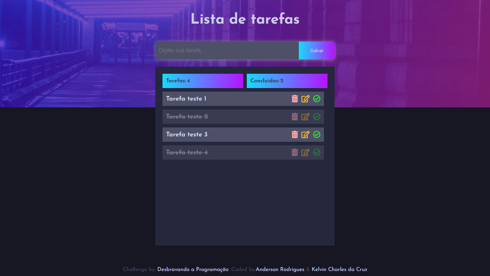

# 🖥️ Projeto To-Do-List da comunidade Desbravando a Programação

## Descrição

Projeto realizado com colaboração, a fim de treinar trabalho em equipe e trocar conhecimentos e experiências! 

## ✍️ Processo

    - Marcação semântica HTML5
    - Propriedades personalizadas de CSS3
    - Flexbox
    - Design responsivo
    - JavaScript

## ⚙ Funcionalidades

    - Criação de novas tarefas 
    - Edição de tarefas criadas 
    - Marcação de tarefas concluídas 
    - Exclusão de tarefas 

>Acesse a página on-line: <a href="https://to-do-list-qu2it1iqs-kelvincharlesdev.vercel.app/" target=_blank> To Do List </a>

🖱️ A página

👩‍💻 Dev's

<table align="center">
    <tr>   
     <td align="center">
            

                 
                <b> Kelvin Charles </b> 
                
                
            

        </td>
      <td align="center">
            

                 
                <b> Anderson Rodrigues </b> 
                
                
            

        </td>
       
    </tr>
</table>

